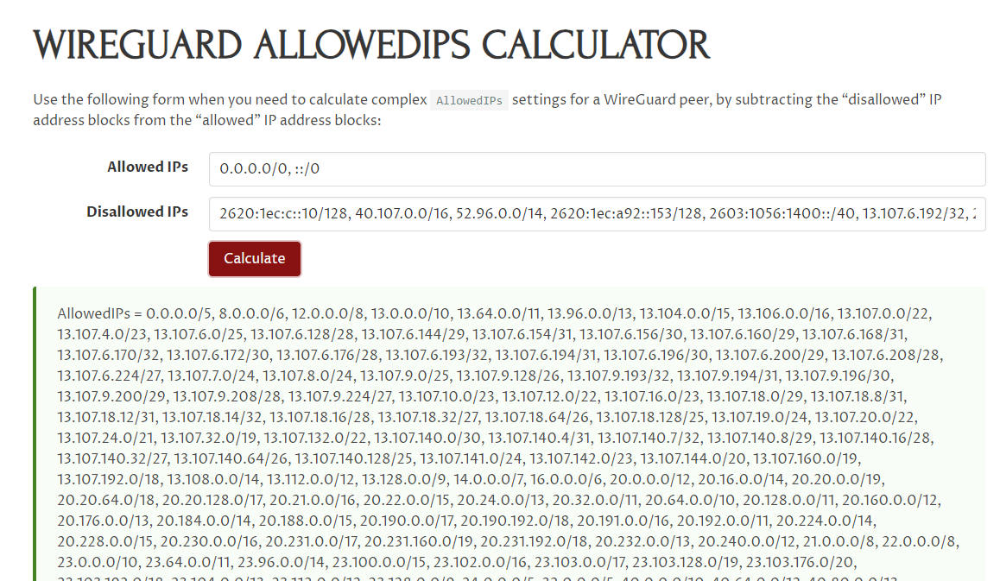

# Overview
A quick Go tool to grab the IPs for m365 services and print out a unique list, for calculating split tunnel VPN configuration that doesn't push e.g. Teams down the VPN.

Uses the data published on [endpoints.office.com](https://endpoints.office.com/) - see [here](http://aka.ms/ipurlws) for documentation. Example data is in [m365_routes.json](./examples/m365_routes.json).

# Running
Our [main.go](main.go) grabs the data from the endpoint, unmarshals the JSON, and creates a map of all the unique IPs for all the entries. It them writes them to a text file of comma separated values.

You can filter with one of `Exchange`, `Skype`, `SharePoint` or `Common`. Leave blank for all. `Skype` means `Skype and Teams`.

```shell
go run main.go -f Common
2024/06/17 09:37:18 Getting data from https://endpoints.office.com/endpoints/worldwide?clientRequestId=b9dd4f30-2d30-42c1-8ada-cc26221351e2
2024/06/17 09:37:18 Parsing data
        Microsoft 365 Common and Office Online 46: 20 IPs
        Microsoft 365 Common and Office Online 56: 16 IPs
        Microsoft 365 Common and Office Online 64: 5 IPs
2024/06/17 09:37:18 Wrote addresses to "20240617_093718_m365_routes_Common.txt"
2024/06/17 09:37:18 Fin.
```

See the [examples](./examples/).

# Example with Wireguard
First grab the data you want. E.g. to filter Teams calls from your VPN, run `go run main.go -f Skype`.

You can add the data to [Allowed IPs calculator](https://www.procustodibus.com/blog/2021/03/wireguard-allowedips-calculator/) to create an allow/blocklist:



This gives us [allowed_teams_only.txt](./examples/allowed_teams_only.txt).

Note trying to filter on all does come with a perfomance hit, presumably because of the huge routing table it creates!

